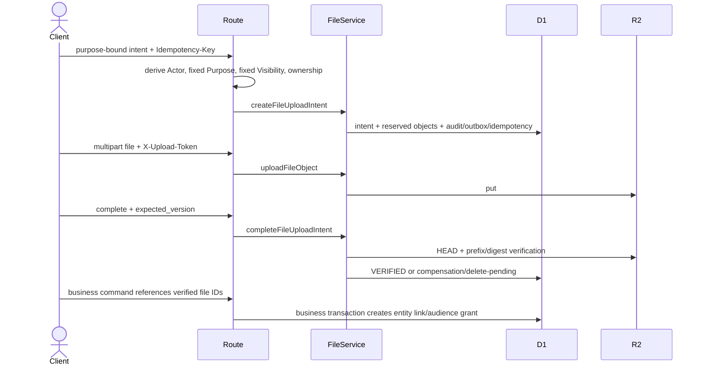

# Design: Wave 13 Frontend Readiness Backend Completion

## 1. Context

Pre-Wave 13 审计确认当前业务 Service、权限引擎、不可变账本、文件生命周期和客户门户基础大体存在，但正式前端仍被三个 P1 阻塞：生产 Staff 登录与内部 Session 缺失；File HTTP、Staff Order Evidence、Staff Buyer Refund 正式 HTTP 闭环缺失；Staff 身份权威边界需要在实现阶段通过正式决策澄清。

本设计以远程规划基线 `5a72fd5d13204a6603ebfe3b39254915972390f8` 和当前 Change 修订前 HEAD `56240b24340e0809c644f5d856655a20b237c20b` 为依据。规划阶段不执行本地命令、不创建 SQL、不修改业务源码、不更新审计结论。

## 2. Existing Capability Inventory

| 能力 | 当前状态 | Wave 13处理 |
|---|---|---|
| `staff_users`、角色、Permission Override、Personal DENY | 已存在 | 直接复用；仅增加 `session_version` |
| `feishu_staff_identities` | 已存在 | 继续作为 Provider identity 到既有 Staff 的最小映射 |
| Team、Department、Leader、Assignment、Data Scope | 已存在 | 每个请求重新计算并用于新 Staff API |
| `resolveAssignmentStaffAuthorization` | 已存在 | 作为 Staff Session Middleware 的统一授权解析器 |
| Staff login state | 缺失 | 0027 最小新增 |
| Internal Staff Session | 缺失 | 0027 最小新增 |
| Staff auth rate limit | 缺失 | 0027 最小新增 |
| Staff auth security event | 缺失 | 0027 最小新增 |
| File upload intent、object upload、complete、read intent | 已存在 | 仅补正式 HTTP Adapter |
| File entity link、explicit audience、动态授权 | 已存在 | 只允许业务命令内部调用 |
| R2 compensation、delete pending、cleanup retry | 已存在 | 复用并补正式故障测试 |
| Order Evidence、两小时修改期限 | 已存在 | 补 Staff HTTP、Scope、Mismatch 确认和原子 approve |
| Formal Order、Claim、Snapshot、Seller Principal Payable | 已存在 | 组合进一个原子 approve command |
| Buyer Refund Payment/Reversal/OVERPAID | 已存在 | 补 Staff list/detail/payment/reversal HTTP |
| Audit、Outbox、Idempotency、Transaction Assertions | 已存在 | 新业务命令继续复用 |

## 3. Goals

1. 让生产 Worker 从飞书认证结果建立内部可信 Staff Session。
2. 让全部现有 Staff/Internal Finance 路由通过默认中间件获得实时 D1 授权。
3. 暴露现有文件系统的正式受控 HTTP Flow。
4. 暴露 Staff Order Evidence 与 Buyer Refund 正式运营 API。
5. 冻结 `/api/*`、Session、安全事件、Mismatch、DTO、错误与 Scope Contract。
6. 定义实现后关闭 Pre-Wave 13 P1 的证据标准。

## 4. Non-Goals

React 正式前端、完整 Staff 工作台、飞书消息/队列/提醒、飞书安全告警、历史迁移、部署、生产资源、财务公式调整、Seller Settlement 重构、全仓 API 版本迁移、Ponytail 重构均不属于本 Change。

## 5. Staff Identity Authority

D1 `staff_users` 及 D1 中的角色、Permission、Personal DENY、Team、Department、Assignment 和 Data Scope 是唯一 Staff 权威。`feishu_staff_identities` 只把经 Provider 验证的稳定身份映射到已存在的 ACTIVE Staff。

客户端、飞书 Header、飞书 Access Token、请求 JSON 和 Query 均不得提交或决定权威 `staff_id`、role、permission、team、department 或 scope。Staff Session 只保存定位 D1 Staff 的不可篡改引用，不保存角色、Permission 或 Data Scope 权威快照。

## 6. Feishu Provider Boundary

飞书是第一版生产 Staff 登录认证 Provider，仅负责证明配置 tenant 中的稳定 `open_id` 已完成认证。Worker 服务端交换 code，映射 `(tenant_key, open_id)`，可使用 `user_id` 进行辅助冲突检查，并签发自己的内部 Session。

飞书不是角色、Permission、Data Scope、Staff API Session、业务事实、财务或安全事件数据库。未知 identity、冲突 binding、inactive identity 或 inactive Staff 均 fail closed，不自动创建 Staff。

### IMPLEMENTATION_PREREQUISITE：Provider 参数

实现阶段必须：

- 依据实现当时的官方飞书文档核验 authorization、token/identity endpoint 和 claim 语义；
- 使用已获批飞书应用；
- 将 endpoint、app id、secret、scope、tenant、redirect URI 全部环境配置化；
- Provider 配置缺失或不一致时 fail closed；
- Provider Adapter 支持测试替身；
- 禁止把 Provider 参数写死进 Domain；
- 禁止凭模型记忆填写生产参数。

## 7. Staff Login Sequence

```mermaid
sequenceDiagram
  actor Browser
  participant Worker
  participant D1
  participant Feishu
  Browser->>Worker: POST /api/staff-auth/login/start {return_to?}
  Worker->>Worker: validate Origin and allowlisted return_to
  Worker->>D1: store hashed state, FEISHU, tenant, callback, 10-minute expiry
  Worker-->>Browser: authorization_url + expires_at
  Browser->>Feishu: authenticate
  Feishu-->>Worker: GET /api/staff-auth/feishu/callback?code&state
  Worker->>D1: atomically consume unexpired ISSUED state
  Worker->>Feishu: server-side code exchange and identity verification
  Worker->>D1: resolve exactly one ACTIVE binding and ACTIVE staff_user
  Worker->>D1: create hashed opaque Staff Session and lifecycle evidence
  Worker-->>Browser: Set-Cookie; 303 allowlisted return_to
```

Login state TTL 固定为 10 分钟。State 使用密码学随机值，D1 只保存 hash，状态单次条件消费；客户端 state 不包含 Staff ID。

## 8. Internal Staff Session

Worker 生成至少 256-bit opaque token，D1 只保存 token hash。Cookie 固定为：

- `__Host-ygb_staff_session`
- `HttpOnly=true`
- `Secure=true`
- `SameSite=Lax`
- `Path=/`
- absolute TTL：12 小时
- `Max-Age=43,200`

第一版明确**没有独立 idle timeout**。这是为了避免每次请求更新 `last_seen` 带来的 D1 写放大、竞争和额外清理复杂度，不是遗漏。0027 不需要为 idle timeout 增加 `last_seen` 权威字段。每次请求仍读取 Session 并重新计算 D1 权限和 Data Scope。

## 9. Session Revocation and Authorization Version

- `POST /api/staff-auth/logout`：撤销当前 Session 并清 Cookie；重复调用保持安全。
- `POST /api/staff-auth/logout-all`：递增 `staff_users.session_version`，撤销该 Staff 全部 ACTIVE Sessions，并清 Cookie。
- inactive Staff：下一请求立即 401。
- expired、revoked、tampered、unknown Session：立即 401。
- `session_version` 不匹配：立即 401，旧 Session 不可恢复。
- `authorization_version` 与签发版本不匹配：立即 401 并要求重新登录。
- 有效 Session 的每个请求仍调用现有 D1 resolver，重新计算角色、GRANT、Personal DENY、Team、Department、Leader package 和 Data Scope。
- Personal DENY 和系统硬禁止最终优先。

## 10. Why Customer Auth Tables Are Not Reused

`customer_login_rate_limits` 和 `customer_auth_security_events` 不作为 Staff 认证记录复用，原因是：

1. Customer 表绑定 Buyer/Seller Customer 身份域、Customer account 和登录标识语义。
2. Staff 认证使用 Provider、tenant、subject、login state 和内部 Session 语义。
3. 强行复用会混淆身份域、事件类型、nullable Actor、索引和保留字段。
4. 修改既有 Customer 表会增加 Customer Auth 回归风险，却不能消除 Staff 专用字段需求。
5. 代码层可复用规范化、hash、时间、限流算法和事件写入模式，但持久化表保持身份域隔离。

## 11. Migration 0027 Decision

**需要最小 Migration：`0027_staff_auth_sessions.sql`。**

最终范围仅包括：

1. `staff_users.session_version INTEGER NOT NULL DEFAULT 1 CHECK(session_version >= 1)`。
2. `staff_login_states`：hashed state、FEISHU provider、tenant/callback/return path、ISSUED/CONSUMED/EXPIRED/CANCELLED、expiry 和单次消费时间。
3. `staff_sessions`：unique token hash、Staff FK、issued `session_version`、issued `authorization_version`、ACTIVE/REVOKED/EXPIRED、absolute expiry 和 revoke metadata。
4. `staff_auth_rate_limits`：hashed key、action、bucket、count、expiry。
5. `staff_auth_security_events`：不可变 event/outcome、nullable Staff/identity/session refs、Provider、hashed/minimized context、request ID、bounded metadata 和 created time。
6. 必要的 unique、FK、CHECK、lifecycle trigger 和 status/expiry indexes。

明确禁止：

- 创建通用多 Provider 身份框架；
- 复制角色、Permission 或 Data Scope 到 Session；
- 保存长期飞书 Token；
- 新增无当前前端用途的身份表；
- 复用或重建 Customer Auth 表；
- 在本规划阶段创建 SQL。

## 12. API Path Decision

Wave 13 新端点和受影响现有端点的唯一正式路径前缀是现有 `/api/*`。

- 不新增 `/api/v2/*`。
- 不为旧文档注册 alias 或双路由。
- 不维护两套 Contract 版本。
- API 整体版本迁移不属于 Wave 13。
- 实现阶段必须修正旧合同/文档中把正式路径写成 `/api/v2/*` 的内容，使其与生产源码 `/api/*` 一致。
- 路由清单、测试、审计重算和前端 SDK 只能统计 `/api/*`。

## 13. File Contract Verification

真实 Contract 中存在以下 `FilePurpose`：

`PRODUCT_APPLICATION_IMAGE`、`PRODUCT_IMAGE`、`ORDER_INSTRUCTION_KEYWORD_IMAGE`、`ORDER_EVIDENCE`、`ORDER_EVIDENCE_INTERNAL_COMMUNICATION`、`REVIEW_EVIDENCE`、`BUYER_REFUND_PROOF`、`SELLER_SETTLEMENT_PROOF`、`SUPPORT_ATTACHMENT`。

真实 `FileVisibility` 仅有：`INTERNAL_ONLY`、`BUYER_VISIBLE`、`SELLER_VISIBLE`。

| Planned HTTP purpose | Existing FilePurpose constant | Status | Action |
|---|---|---|---|
| Buyer Order Evidence | `ORDER_EVIDENCE` | EXISTING | 直接复用；路由固定 `BUYER_VISIBLE`，不得 Seller 可见 |
| Buyer Review Evidence | `REVIEW_EVIDENCE` | EXISTING | 直接复用；路由固定 `SELLER_VISIBLE`，业务命令仍创建 Buyer/Seller/Staff explicit audiences |
| Seller Product Application Images | `PRODUCT_APPLICATION_IMAGE` | EXISTING | 直接复用；路由固定 `SELLER_VISIBLE` |
| Staff Order Evidence Internal Communication | `ORDER_EVIDENCE_INTERNAL_COMMUNICATION` | EXISTING | 直接复用；路由固定 `INTERNAL_ONLY` |
| Staff Buyer Refund Proofs | `BUYER_REFUND_PROOF` | EXISTING | 直接复用；路由固定 `INTERNAL_ONLY` |
| Staff Seller Settlement Proofs | `SELLER_SETTLEMENT_PROOF` | EXISTING | 直接复用；路由固定 `INTERNAL_ONLY` |

Wave 13 不为 `PRODUCT_IMAGE`、`ORDER_INSTRUCTION_KEYWORD_IMAGE` 或 `SUPPORT_ATTACHMENT` 新增通用上传端点。六个规划 Purpose 均为 EXISTING，因此不需要 FilePurpose Contract 扩展。

## 14. File HTTP Flow



HTTP 不接受 owner、organization authority、buyer/seller/staff authority、scope、audience、object key、permanent URL 或任意 entity authority。不存在无权限的通用 link/grant route。

## 15. Staff Order Evidence and PRICE_MISMATCH

最终支付金额的业务权威是订单截图显示的最终实际支付金额。`reference_order_amount_jpy` 仅是参考事实；与 `final_paid_jpy` 不同不自动表示资料错误。

Staff review rules:

1. 截图与买家填写的 `final_paid_jpy` 不一致、截图不清楚或无法证明最终金额：Staff 必须使用 request-changes，不得 approve。
2. 截图清楚证明 `final_paid_jpy`，且仅与 reference amount 不同：具有 `ORDER_CONFIRM` 的 Staff 可以 approve，但必须显式提交：
   - `price_mismatch_acknowledged: true`
   - `price_mismatch_reason`: 非空内部原因
3. 存在 mismatch 但 acknowledgment 缺失或为 false：返回 HTTP 409 `PRICE_MISMATCH`，不得形成 Formal Order。
4. 存在 mismatch 且 acknowledgment=true 但 reason 为空/缺失：返回 400 `VALIDATION_ERROR`。
5. 不存在 mismatch 时，`price_mismatch_acknowledged=true` 或非空 `price_mismatch_reason` 均返回 400 `VALIDATION_ERROR`；acknowledged 缺失或 false 且无 reason 可通过。
6. 不新增 Permission；继续使用 `ORDER_CONFIRM`、Personal DENY、Assignment、Data Scope、`expected_version` 和 Idempotency-Key。
7. Request hash 必须包含 acknowledgment 和规范化 reason；Replay 必须返回首次已提交结果，不能改变 reason。
8. Audit 和 Formal Order Event 必须记录：
   - `reference_order_amount_jpy`
   - `final_paid_jpy`
   - `price_difference_jpy`
   - `price_mismatch_acknowledged`
   - `price_mismatch_reason`
   - `confirmed_by_staff_id`
9. Buyer 可见 DTO 不得暴露内部 reason。
10. Formal Order 和财务快照继续使用最终实际 `final_paid_jpy`，不得使用 reference amount 覆盖。

Approve body 最终 exact-key Contract：

- 必填：`expected_version`
- 可选：`internal_note`
- 可选：`price_mismatch_acknowledged`
- 可选：`price_mismatch_reason`

新 orchestrator 必须复用现有 Evidence、Claim、Formal Order、Snapshot、Payable、Audit、Outbox、Idempotency 和 assertion builders，并在一个 D1 atomic batch 中完成；不能先提交 verify，再单独提交 Formal Order。

## 16. Staff Buyer Refund

Buyer Refund 继续复用现有 append-only Payment/Reversal ledger、整数分、decimal-string DTO、OVERPAID、proof linking、Audit、Outbox、Idempotency 和 assertions。Payment/Reversal 不得 UPDATE 或 DELETE 原事实，也不得复用 Seller Settlement Permission、DTO、ledger 或 route。

## 17. Permission and Data Scope

| Action | Permission | Scope | Scope miss |
|---|---|---|---|
| Staff Session read/logout | 当前 Session self | self | 401 when invalid |
| Internal Finance | 现有 `FINANCIAL_*` | 现有 owner/global rules | 403/404 |
| Order Evidence list/detail | `ORDER_VIEW` | assigned buyer/work item/team/global | 404 |
| Request Changes / Approve | `ORDER_CONFIRM` + existing role policy | assigned evidence/buyer/work item | 404 |
| Buyer Refund list/detail | `BUYER_REFUND_VIEW` | refund/buyer/team/global | 404 |
| Refund Payment/Reversal | `BUYER_REFUND_RECORD` | processing assignment + obligation scope | 404 |
| Internal file upload/read | 对应业务 Permission | entity scope + current grant | 404 |
| Customer file upload/read | 当前 Customer business authority | own tenant/entity | 404 |

不新增 Permission。Personal DENY 最终优先。列表在 SQL 中过滤 Scope，禁止先读全量再过滤。

## 18. API Inventory

### Staff Auth

- `POST /api/staff-auth/login/start`
- `GET /api/staff-auth/feishu/callback`
- `GET /api/staff-auth/session`
- `POST /api/staff-auth/logout`
- `POST /api/staff-auth/logout-all`

### Purpose-bound File Intent

- `POST /api/buyer-portal/file-uploads/order-evidence/intents`
- `POST /api/buyer-portal/file-uploads/review-evidence/intents`
- `POST /api/seller-portal/file-uploads/product-application-images/intents`
- `POST /api/staff/file-uploads/order-evidence-internal-communication/intents`
- `POST /api/staff/file-uploads/buyer-refund-proofs/intents`
- `POST /api/staff/file-uploads/seller-settlement-proofs/intents`

### Domain-bound File Lifecycle

- `PUT /api/{buyer-portal|seller-portal|staff}/file-uploads/:fileObjectId/content`
- `POST /api/{buyer-portal|seller-portal|staff}/file-upload-intents/:id/complete`
- `POST /api/{buyer-portal|seller-portal|staff}/files/:fileObjectId/read-intents`
- `GET /api/{buyer-portal|seller-portal|staff}/file-read-intents/:id/content`

### Staff Order Evidence

- `GET /api/staff/order-evidence`
- `GET /api/staff/order-evidence/:id`
- `POST /api/staff/order-evidence/:id/request-changes`
- `POST /api/staff/order-evidence/:id/approve`

### Staff Buyer Refund

- `GET /api/staff/buyer-refunds`
- `GET /api/staff/buyer-refunds/:id`
- `POST /api/staff/buyer-refunds/:id/payments`
- `POST /api/staff/buyer-refunds/:id/payments/:paymentEntryId/reversals`

## 19. Request and Query Contract

- JSON mutation body 必须大小有界、exact-key、未知字段和 authority 字段拒绝。
- Query 必须拒绝未知和重复参数。
- List `limit` 为规范十进制整数，默认 25，范围 1–100。
- Cursor 为版本化 base64url opaque payload，最大 2 KiB。
- `from/to` 使用 inclusive 中国业务日期，除非既有 route Contract 明确另一 date basis。
- Order Evidence request-changes：`expected_version`、`public_reason`、可选 `internal_note`。
- Order Evidence approve：使用第 15 节 exact-key Contract。
- Refund payment/reversal：CNY 使用 canonical decimal-string fen；时间和业务日期显式校验。
- File response 只返回 opaque ID、version、status、expiry 和一次性 token availability，不返回 R2 key/permanent URL。

## 20. Error Contract Verification

| HTTP | Public code | Contract status | Boundary |
|---:|---|---|---|
| 400 | `VALIDATION_ERROR` | EXISTING | malformed/unknown/mismatch reason validation |
| 401 | `UNAUTHENTICATED` / `SESSION_INVALID` | EXISTING | invalid Staff Session |
| 403 | `FORBIDDEN` | EXISTING | missing operation Permission / invalid upload token |
| 404 | `NOT_FOUND` or domain not-found | EXISTING | missing or concealed out-of-scope resource |
| 409 | `PRICE_MISMATCH` | CONTRACT_EXTENSION_REQUIRED | mismatch requires explicit ack before approve |
| 409 | `STATE_CONFLICT` / domain state conflict | EXISTING | other invalid state |
| 409 | `VERSION_CONFLICT` | EXISTING | stale expected version |
| 409 | `IDEMPOTENCY_CONFLICT` | EXISTING | same key, different hash |
| 409 | `REQUEST_IN_PROGRESS` | EXISTING | active idempotency lease |
| 410 | `FILE_UPLOAD_EXPIRED` | EXISTING | expired upload/read intent |
| 422 | `FILE_VALIDATION_FAILED` | EXISTING | MIME/magic/size/digest |
| 429 | `RATE_LIMITED` | EXISTING | auth rate limit |
| 503 | `DEPENDENCY_UNAVAILABLE` | EXISTING | Provider/R2/D1 unavailable |
| 503 | `FILE_COMPENSATION_REQUIRED` | EXISTING | compensation delete failed |

`FILE_COMPENSATION_REQUIRED` 已存在于正式 `API_ERROR_CODES`。`PRICE_MISMATCH` 当前不存在，Wave 13 实现必须以最小 Contract 扩展加入公共错误目录和 Order Evidence 错误映射；不得改用模糊 state conflict 伪装。

## 21. 401/403/404 Rules

- 无有效 Staff Session：401。
- Session 有效但缺少操作 Permission：403。
- 有 Permission 但资源超 Data Scope、Assignment 或 Ownership：404。
- Buyer/Seller 跨租户：404。
- Provider identity 未绑定：固定认证失败，不说明 Staff 是否存在。
- File token 错误：403；资源超 Scope：404；已知 intent 到期：410。

## 22. Idempotency and Transaction Boundaries

- 关键业务 mutation 使用当前 Staff/Customer Actor、canonical request hash、`expected_version`、Audit、Outbox 和 Transaction Assertion。
- Order Evidence approve request hash 包含 mismatch acknowledgment 和 reason。
- 相同 key/hash replay 返回原 committed response；不得重新解释或替换 mismatch reason。
- 同 key 不同 hash：`IDEMPOTENCY_CONFLICT`。
- active lease：`REQUEST_IN_PROGRESS`。
- stale version：`VERSION_CONFLICT`。
- Order Evidence approve 在一个 D1 batch 中完成 verify、claim、Formal Order、snapshot、payable、consume、events、audit/outbox/idempotency/assertions。
- Provider 网络调用不进入 D1 batch；state 先单次消费，失败写安全事件。

## 23. Audit, Security Events and Alert Boundary

Wave 13 负责：

- `staff_auth_security_events` 不可变持久化；
- 已知 Staff 的认证成功和 Session 生命周期 Audit；
- 登录失败、限流、state 重放、identity 冲突、Provider 失败、Session 拒绝事件；
- 后续消费者所需的结构化字段、request ID、hashed/minimized context；
- Order Evidence mismatch acknowledgment facts进入 Audit 和 Formal Order Event。

Wave 13 不负责：

- 飞书实时安全告警；
- 安全消息推送；
- 值班通知；
- 运营提醒。

这些告警/通知属于后续 **Wave 16**。Wave 13 不为认证失败创建飞书通知 Outbox，也不把“未做告警”当作持久化遗漏。

## 24. R2 Compensation

继续复用现有 `compensateStoredObjects`。R2 put 后 receipt、HEAD、prefix、digest 或 D1 commit 失败时执行补偿删除；删除失败进入 delete-pending、递增 attempts、计算 retry time，并返回现有 503 `FILE_COMPENSATION_REQUIRED`。Cleanup 幂等重试，不创建业务 link，不泄漏 object key。

## 25. Rate Limits, Capacity and Cleanup

- Login state TTL：10 分钟。
- Staff Session absolute TTL：12 小时；无 idle timeout。
- Login start 默认每 hashed network key 10 次/10 分钟。
- Callback failure 默认每 state/network/provider subject hash 10 次/10 分钟。
- Provider timeout 默认 5 秒；仅明确可重试网络错误可执行一次受控重试。
- Rate-limit 行按窗口 expiry 清理。
- Security events 按治理保留，不作为临时表删除。
- File intent/read intent 和 delete-pending cleanup 沿用现有策略。
- List endpoint limit 最大 100。

## 26. Privacy and DTO Projection

禁止响应或持久化到不当位置的内容包括：Session token/hash、Provider token、完整 Provider claims、R2 object key、永久 URL、其他租户 identity、Seller internal profit、Buyer Refund cost/proof 给 Seller、internal mismatch reason 给 Buyer。

Staff DTO 使用操作白名单；Buyer/Seller DTO 继续身份域白名单。Buyer 只看到必要的 public reason、deadline 和 status，不看到 `price_mismatch_reason`。

## 27. Testing Strategy

### PRICE_MISMATCH

必须规划并实现：

1. mismatch 且无 ack 返回 409 `PRICE_MISMATCH`。
2. mismatch 且 ack=false 返回 409 `PRICE_MISMATCH`。
3. mismatch 且 ack=true 但无/空 reason 返回 `VALIDATION_ERROR`。
4. mismatch 且 ack=true、reason 非空、截图清楚证明 final amount 时确认成功。
5. 无 mismatch 但 ack=true 返回 `VALIDATION_ERROR`。
6. Buyer 填写金额与截图不一致时必须 request-changes，不得 approve。
7. Audit 和 Formal Order Event 包含完整差额确认事实。
8. Replay 返回原确认结果且不能改变 mismatch reason。

### Staff Auth

覆盖 state 错误/过期/重放、Provider timeout、配置缺失、identity 冲突、inactive Staff、Cookie tamper、expiry/revoke、session/authorization version、Personal DENY、logout/logout-all、Header bypass、无 idle timeout 的 12 小时 absolute expiry。

### File HTTP

覆盖六个现有 Purpose、固定 Visibility、authority injection、MIME/size/digest、expiry、replay、HEAD/D1 failure、compensation delete、cleanup retry、cross-tenant 和 DTO leakage。

### Buyer Refund and Contract

覆盖 split payment、reversal、OVERPAID、proof、Scope、immutable facts、Seller isolation、unknown body/query、duplicate query、cursor、limit、money/date 和 401/403/404。

测试层次包括 pure unit、route、production entrypoint E2E、真实 D1 migration/behavior、R2 failure/compensation、security verifier、DTO isolation verifier 和全回归。

## 28. Migration and Rollback

0027 从 schema 26 连续执行，验证 schema version 27、FK、integrity、indexes、CHECK/triggers 和 application table 增量。覆盖空库、schema-26 upgrade、duplicate hash、invalid lifecycle、state double consume、session version bump 和 Customer Auth 不回归。

不创建 destructive down migration。若应用发布失败，关闭 Staff login entry、递增 session versions/撤销 Sessions，并以 forward fix 修复；新增表/列保留，历史业务和财务不受影响。

## 29. Audit Closure

实现后更新现有三份审计文档和现有 `pre-wave13-baseline-conformance-audit` Change，不创建第二份审计。重新统计 `/api/*` 端点、READY 状态、P0/P1/P2/P3、GO/NO_GO 和 Local Validation Supplement。

- P1-01：仅在 Staff login、Session、Middleware、default app 和 production-entrypoint E2E 完整后关闭。
- P1-02：仅在 File HTTP、Staff Order Evidence、Staff Buyer Refund 可达并通过 Scope/Contract/D1/R2 测试后关闭。
- P1-03：仅在实现阶段正式澄清 D-004 且保留历史后关闭。

## 30. Threat Model

| Threat | Control |
|---|---|
| OAuth CSRF/state substitution | random hashed state、Origin、callback binding、single consume |
| Callback replay | consumed state + immutable security event |
| Provider impersonation | server exchange、configured tenant、stable binding |
| Unknown Staff auto-provision | explicit deny |
| Session theft/fixation | Secure HttpOnly `__Host-` cookie、新 256-bit token、12h expiry、revoke/version |
| Cookie tampering | opaque token hash and constant-time comparison |
| Feishu Header bypass | default middleware ignores Provider identity headers |
| Stale authorization | every-request D1 recalculation + authorization version 401 |
| Personal DENY bypass | shared effective resolver，DENY final |
| Cross-tenant enumeration | Permission then Scope; Scope miss 404 |
| Authority injection | exact-key and server-derived authority |
| File spoofing/orphan | magic/MIME/SHA/HEAD + compensation |
| Mismatch without review | explicit ack/reason or 409 `PRICE_MISMATCH` |
| Double order/refund | unique claim、version、idempotency、assertion |
| Sensitive DTO leak | allowlist projection and recursive verifier |

## 31. Rejected Alternatives

- 直接信任飞书 Access Token/Header。
- 客户端提交 Staff Actor、role、Permission 或 Scope。
- 未绑定 identity 自动创建 Staff。
- 把飞书作为 Permission、Session 或业务数据库。
- 通用多 Provider 身份框架。
- 复用 Customer Auth 持久化表承载 Staff 语义。
- 在 Session 中复制 Permission/Data Scope 权威。
- 每请求更新 `last_seen` 并实现第一版 idle timeout。
- 注册 `/api` 与 `/api/v2` 双路由。
- 通用无权限文件 link/grant API。
- 新建第二套 File 或 Buyer Refund 模型。
- 新增仅为命名整齐的 Permission。
- 将 verify 与 Formal Order 分两次提交。
- 使用 reference amount 覆盖截图证明的 final amount。
- 将内部 mismatch reason 暴露给 Buyer。

## 32. Implementation Prerequisites

以下不是业务或架构未决项，全部标记为 `IMPLEMENTATION_PREREQUISITE`：

1. **IMPLEMENTATION_PREREQUISITE — Feishu app configuration**：获批 app id/secret、官方 endpoint、scope、tenant 和 redirect URI，按环境配置。
2. **IMPLEMENTATION_PREREQUISITE — Staff web origins and return paths**：local/staging/production 的 allowed Origin、callback URL 和 `return_to` allowlist。
3. **IMPLEMENTATION_PREREQUISITE — Secret and environment provisioning**：在授权的部署流程中提供 Secret/Bindings；缺失时 fail closed。

实现者不得重新选择 PRICE_MISMATCH、API Path、Session TTL、Provider 权威或安全告警边界。

## REMOTE_PLANNING_REVIEW

本次远程语义复核结论：**PASS（planning semantics only）**。

- PRICE_MISMATCH 规则唯一明确：截图证明的 final amount 为权威；参考差额需 `ORDER_CONFIRM` Staff 显式 ack+reason，否则 409 `PRICE_MISMATCH`。
- `/api/*` 是唯一正式路径，不注册 `/api/v2` alias。
- Login state 10 分钟、Staff Session absolute 12 小时、无 idle timeout 已冻结。
- 0027 保持 `session_version` 加四张 Staff auth 表的最小范围。
- 飞书仍仅为认证 Provider；D1/Worker Session 是权威边界。
- 六个规划 FilePurpose 均对应真实 EXISTING 常量；FileVisibility 使用真实三值。
- `FILE_COMPENSATION_REQUIRED` 为 EXISTING；`PRICE_MISMATCH` 标记为 CONTRACT_EXTENSION_REQUIRED。
- 未修改业务代码、Migration、测试、审计或 Decision Register。
- 实现、local、OpenSpec CLI、Verify、Ponytail 和 Integration tasks 均未勾选。
- Requirement 总数保持 52，Scenario 总数保持 104。

`REMOTE_PLANNING_REVIEW` 不是 OpenSpec CLI validate，也不是 OpenSpec Verify。
