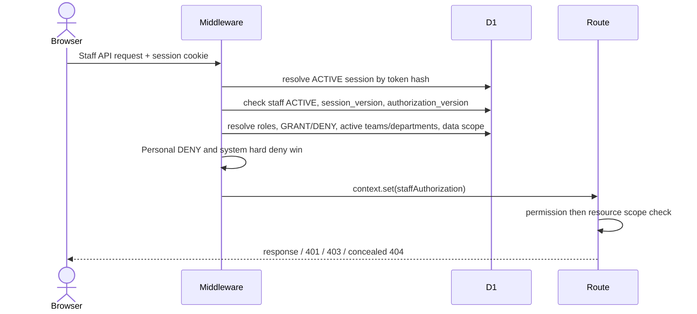
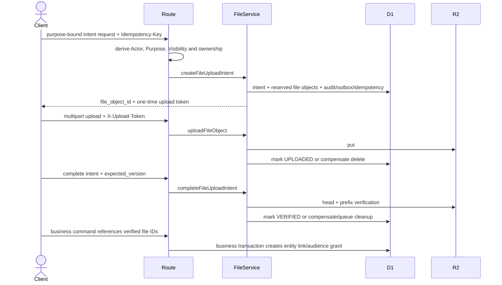
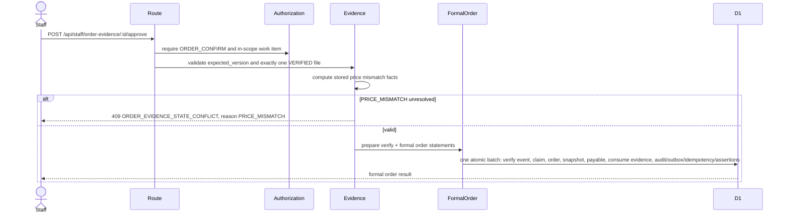
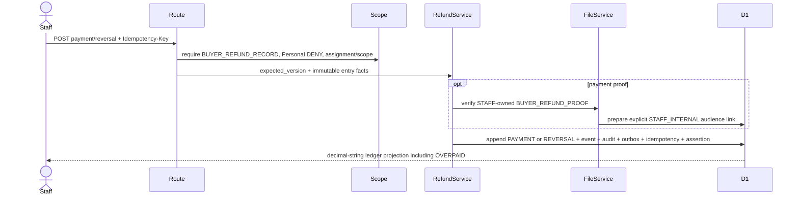

# Design: Wave 13 Frontend Readiness Backend Completion

## 1. Context

Pre-Wave 13 审计已证明当前 `main` 的业务 Service、权限引擎、账本、文件和门户基础大体存在，但生产 HTTP 入口仍有三个固定 P1：可信 Staff 登录与 Session 缺失；File Upload、Staff Order Evidence、Staff Buyer Refund 正式 HTTP 闭环缺失；旧决策与最新 Staff 权威边界冲突。当前审计本地补充已记录 schema 26、113 application tables、213 triggers、10 views、99 test files、511 tests 和 `npm run check` 通过，但这些历史证据没有关闭 P1，也不能替代 Wave 13 的实现后验证。

本设计以远程 SHA `5a72fd5d13204a6603ebfe3b39254915972390f8` 为只读规划基线。规划阶段不执行本地命令、不创建 SQL、不修改业务源码、不更新审计结论。

## 2. Existing Capability Inventory

| 能力 | 已存在 | 可直接复用 | 需要扩展 | 证据 |
|---|---|---|---|---|
| `staff_users` 主体与状态 | 是 | 主体、`status`、`authorization_version`、`version` | 增加 `session_version` | `migrations/0002_staff_identity_permissions.sql` |
| 飞书 Staff identity binding | 是 | `(tenant_key, open_id)` 稳定映射、`user_id` 辅助校验、唯一约束、ACTIVE/REVOKED | 回调 Provider adapter 与冲突审计 | `feishu_staff_identities`、`provision-staff.ts` |
| Staff Role Assignment | 是 | 多角色、ACTIVE/REVOKED | 无 Schema 扩展 | `staff_role_assignments` |
| Permission Override / Personal DENY | 是 | GRANT、DENY，DENY 最终优先 | 中间件统一调用 | `staff_permission_overrides`、`authorization-policy.ts` |
| Team / Department / Leader | 是 | ACTIVE membership、leader package、department status | 无 Schema 扩展 | `staff-assignment/effective-authorization.ts` |
| Data Scope | 是 | GLOBAL、ASSIGNED_BUYERS、ASSIGNED_SELLER_ORGANIZATIONS、TEAM_ASSIGNMENTS | 让新 Staff Read Models 使用 | `staff-assignment/data-scope.ts` |
| Feishu resolver | 部分 | identity mapping 规则和 fail-closed 语义 | 拆分为 Provider mapping 与按 `staff_id` 重算授权 | `staff/staff-authorization.ts` |
| 按 `staff_id` 重算授权 | 是 | 角色、Permission、DENY、Team、Department、Scope | Staff middleware 调用 | `resolveAssignmentStaffAuthorization` |
| Staff login state | 否 | 无 | 新表、单次消费、TTL、Provider/redirect 绑定 | 未发现对应 Migration/Service |
| Internal Staff Session | 否 | Customer Session 的 cookie/secret/中间件模式仅作实现参考 | 新 Staff 专用 opaque session、撤销、版本检查 | `customer-auth/**` 仅属于 Customer Auth |
| Staff auth rate limit | 否 | 可复用基础清理/时间模式 | 新 Staff 专用 rate-limit records | 现有登录限流不应跨身份域复用权威记录 |
| Staff auth security event | 否 | 可复用规范 JSON、request id、审计风格 | 新不可变安全事件表 | 未发现对应表 |
| Session revoke | 否 | `staff_users.status` 与 `authorization_version` 可触发失效 | current revoke、logout-all、expiry cleanup | 无 Staff Session 表 |
| File upload intent | 是 | Purpose、Visibility、Manifest、15 分钟默认 TTL、幂等 | HTTP adapter | `files/create-upload-intent.ts` |
| File object upload | 是 | token、魔数、MIME、size、SHA-256、R2 put | multipart HTTP adapter | `files/upload-file-object.ts` |
| File complete | 是 | HEAD、metadata、prefix/digest、版本、幂等 | HTTP adapter | `files/complete-upload-intent.ts` |
| File link / audience grant | 是 | entity link、explicit audiences、Staff/Buyer/Seller 动态授权 | 仅由业务命令内部调用 | `explicit-audience-links.ts`、`file-audience-authorization.ts` |
| Short read intent | 是 | 5 分钟默认 TTL、单次 token、对象再校验 | HTTP adapter | `files/file-read-service.ts` |
| R2 compensation / cleanup | 是 | 删除补偿、delete pending、重试清理 | 正式故障测试与可观测性 | `files/compensation.ts`、cleanup scripts/services |
| Order Evidence submit/read/review | 是 | 状态机、两小时修改期限、Audit/Outbox/Idempotency | Staff HTTP、Scope、严格一张截图入口 | `order-evidence/**` |
| Formal Order confirmation | 是 | order claim、snapshot、seller payable、transaction assertions | 与 verify 组成原子 Staff approval orchestrator | `formal-orders/confirm-formal-order.ts` |
| Buyer Refund ledger | 是 | append-only Payment/Reversal、OVERPAID、整数分 | Staff list/detail/routes/scope | `buyer-refunds/**` |
| Audit | 是 | 业务成功事件、Actor、request/idempotency context | Staff auth lifecycle 与安全事件边界 | `foundation/audit` |
| Outbox | 是 | 业务状态同步事件、dedup | 新业务命令复用；认证失败不外发 PII | `foundation/outbox` |
| Command Idempotency | 是 | request hash、lease、replay/conflict | 所有新 mutation adapter 复用 | `foundation/idempotency` |

## 3. Audit Findings Being Closed

- **P1-01**：生产入口注册 Staff/Internal Finance 路由，却没有可信登录、内部 Session 或默认中间件生成 `staffAuthorization`。
- **P1-02**：正式 HTTP 入口缺少 File HTTP、Staff Order Evidence、Staff Buyer Refund。
- **P1-03**：旧决策把飞书描述为员工身份来源/工作入口，但最新治理要求独立 Staff 主体和可信内部 Session；必须通过正式决策澄清而非删除历史。

本 Change 不降低严重级别，不把 Service 存在描述为 HTTP 已可用，不把 fail-closed 路由描述为前端 ready。

## 4. Goals

1. 让生产 Worker 能从飞书认证结果建立内部可信 Staff Session。
2. 让所有现有 Staff/Internal Finance 路由通过默认中间件获得实时 D1 授权。
3. 暴露现有文件系统的正式受控 HTTP Flow。
4. 暴露 Staff Order Evidence 与 Buyer Refund 的正式运营 API。
5. 冻结大模块 5 的关键 Contract、安全、DTO 与错误边界。
6. 定义实现后更新既有 Pre-Wave 13 审计的关闭标准。

## 5. Non-Goals

React 正式前端、完整 Staff 工作台、飞书消息/队列/提醒、历史迁移、部署、生产资源、财务公式调整、Seller Settlement 重构、全仓 API 版本迁移、Ponytail 重构均不属于本 Change。

## 6. Staff Identity Authority

D1 `staff_users` 是 Staff 主体、ACTIVE 状态、角色、Permission、Personal DENY、Team、Department 和 Data Scope 的唯一权威。`feishu_staff_identities` 只把经 Provider 验证的稳定身份映射到已存在 Staff。客户端永远不能提交权威 `staff_id`、role、permission、team 或 scope。

Staff Session 保存的 `staff_id` 只是定位 D1 主体的不可篡改引用；Session 不保存权限权威快照。每个请求都重新查询 D1 并计算授权。

## 7. Feishu Provider Boundary

飞书是第一版 Staff 登录认证 Provider，负责证明某个 tenant 中的某个 `open_id` 完成了认证。Provider adapter 必须服务端交换 code、验证配置 tenant、处理超时和非成功响应，并只返回最小声明：provider、tenant key、open id、可选 user id。

飞书不是角色、Permission、Data Scope、Staff API Session、业务事实或财务数据库。Provider Access Token 不返回浏览器，不写长期业务表，默认仅在回调请求内存中存在。未知 identity、重复/冲突 binding、inactive identity 或 inactive Staff 均拒绝，不自动创建 Staff。

## 8. Staff Login Sequence

```mermaid
sequenceDiagram
  actor Browser
  participant Worker
  participant D1
  participant Feishu
  Browser->>Worker: POST /api/staff-auth/login/start {return_to?}
  Worker->>Worker: validate Origin and allowlisted return_to
  Worker->>D1: store hashed random state, provider, tenant, callback, TTL
  Worker-->>Browser: authorization_url + expires_at
  Browser->>Feishu: authenticate
  Feishu-->>Worker: GET callback?code&state
  Worker->>D1: atomically consume unexpired ISSUED state
  Worker->>Feishu: server-side code exchange and identity verification
  Feishu-->>Worker: tenant_key + open_id (+ user_id)
  Worker->>D1: resolve exactly one ACTIVE binding and ACTIVE staff_user
  Worker->>D1: create hashed opaque Staff Session + security/audit events
  Worker-->>Browser: Set-Cookie HttpOnly; 303 allowlisted return_to
```

登录 `state` 使用密码学随机值，数据库只保存 hash。默认 TTL 为 10 分钟，状态为 ISSUED、CONSUMED、EXPIRED 或 CANCELLED；单次条件更新消费。客户端 state 不包含权威 Staff ID。

## 9. Session Trust Boundary

Worker 生成至少 256-bit opaque token，数据库只保存 token hash。Cookie：

- name: `__Host-ygb_staff_session`
- `HttpOnly=true`
- `Secure=true`
- `SameSite=Lax`
- `Path=/`
- absolute TTL: 12 hours
- Max-Age: 43,200 seconds

浏览器持有的 token 不能解码出 role、permission、scope 或 Provider token。回调成功后总是生成新 Session ID，防止 Session fixation。

## 10. Session Revocation

- `POST /api/staff-auth/logout`：条件撤销当前 session，清 Cookie；重放保持成功。
- `POST /api/staff-auth/logout-all`：增加 `staff_users.session_version`，撤销该 Staff 的全部 ACTIVE sessions，并清当前 Cookie。
- Staff 变为非 ACTIVE：下次请求立即 401 并撤销当前 session。
- session 到期：下次请求 401；cleanup 归档/删除已过保留期的临时记录。
- `session_version` 不匹配：401，并撤销 session。
- `authorization_version` 不匹配：为确保授权变更立即生效，当前 session 失效并返回 401；用户重新认证后获得新版本。即使实现选择继续当前会话，也不得继续使用旧权限快照；本 Change 默认采用强制重新认证。

## 11. Authorization Recalculation



中间件复用 `resolveAssignmentStaffAuthorization`，不复制另一套权限算法。解析失败时不执行后续 Staff 路由。`staffAuthorization` 包含 Staff ID、展示名、角色集合、有效 Permission、member/leader team IDs 和 Data Scope。

## 12. Existing Schema Analysis

现有 Schema 已满足：Staff 主体、ACTIVE 状态、`authorization_version`、飞书 identity binding、角色、多角色、Permission override、Personal DENY、Team/Department、Assignment、Work Item、Audit、Outbox 和 Idempotency。

现有 Schema 不满足：

- 没有 `session_version`，无法一次撤销某 Staff 的所有内部 Session。
- 没有短期、单次消费的 Staff login state。
- 没有可逐条撤销、到期和审计的 Staff session record。
- 没有 Staff 登录专用 rate-limit record。
- 没有未知 Actor/失败 Provider 回调可安全记录的 Staff auth security event。

`feishu_staff_identities` 已是当前 Provider 所需最小 binding；不创建通用多 Provider 身份框架，不增加 union_id 作为第一版必需字段，不自动创建 Staff。

## 13. Migration Decision

**Decision B：需要最小 Migration 0027。**

建议名称：`0027_staff_auth_sessions.sql`。

建议变更：

1. `staff_users.session_version INTEGER NOT NULL DEFAULT 1 CHECK(session_version >= 1)`。
2. `staff_login_states`：UUID、`state_hash` unique、provider FEISHU、tenant key、callback purpose、allowlisted return path、status、expires/consumed/cancelled timestamps、request/origin context、created/updated。
3. `staff_sessions`：UUID、token hash unique、Staff FK、issued session/authorization versions、ACTIVE/REVOKED/EXPIRED status、expires、last seen、revoked reason/timestamps、created/updated。
4. `staff_auth_rate_limits`：hashed key、bucket、count、expires/updated，唯一 `(key_hash, bucket_start, action)`。
5. `staff_auth_security_events`：不可变 event type/outcome、nullable staff/identity/session refs、provider、hashed tenant/subject/network context、request ID、bounded canonical metadata、created_at。
6. 索引：state status+expiry、session staff+status+expiry、session token hash、rate-limit expiry、security-event created/staff。
7. Trigger/CHECK：生命周期状态、单次消费、不可逆 revoked/consumed、时间顺序、不可更新/删除安全事件。

Migration 不保存飞书 token，不复制角色/Permission/Scope，不读取历史生产数据。既有 Staff 自动得到 `session_version=1`；没有历史 Session 需要迁移。回滚边界是“应用未依赖新列/表前可回退”；一旦签发 Session，不通过 destructive down migration 回滚，改为停用新入口并撤销 sessions。

## 14. File HTTP Sequence



HTTP 不接受 owner、owner_id、organization authority、buyer/seller/staff authority、scope、audience、object_key、permanent URL 或任意 entity authority。Purpose 由路径固定；文件数量、MIME、大小和 digest 继续由现有 policy 校验。

## 15. Staff Order Evidence Sequence



新 orchestrator 必须复用现有验证、claim、snapshot、payable 和 statement builders；不能先调用一个已提交的 `verifyOrderEvidence`，再调用第二个已提交的 `confirmFormalOrder`。最终成功要么全部存在，要么全部不存在。

## 16. Staff Buyer Refund Sequence



Payment 和 Reversal 都是新事实；禁止 UPDATE/DELETE 旧 Payment。Reversal 必须引用原 Payment，且不能超过其未冲销余额。Buyer Refund 与 Seller Settlement 不共享 Permission、DTO、ledger 或 route。

## 17. Permission Matrix

| API/Action | Identity | Permission | Data Scope | Concealment | Personal DENY |
|---|---|---|---|---|---|
| Staff Session read | ACTIVE Staff Session | 无业务 Permission；仅 self | self | invalid session 401 | 不适用业务 Permission |
| Staff logout/logout-all | ACTIVE Staff Session | 无业务 Permission；仅 self | self | invalid session 401 | 不适用 |
| Staff Work Items | Staff | 现有 `TASK_VIEW_SELF`/`TASK_VIEW_TEAM`/对应 mutation Permission | self/team assignment | 超 Scope 404 | 生效 |
| Internal Finance | Staff | `FINANCIAL_VIEW`/`FINANCIAL_CORRECT`/`FINANCIAL_EXPORT` | owner/global +现有规则 | 无 Permission 403；资源超 Scope 404 | 最终优先 |
| File Upload: Order Evidence | Buyer session | 当前 Buyer reservation/evidence authority | own buyer reservation | 404 | 不适用 |
| File Upload: Review Evidence | Buyer session | 当前 Buyer review authority | own buyer review | 404 | 不适用 |
| File Upload: Product Application | Seller session | 当前 product application create authority | own organization/store | 404 | 不适用 |
| File Upload: Internal Evidence | Staff | `ORDER_VIEW`/`ORDER_CONFIRM` 按动作 | evidence/work-item scope | 404 | 生效 |
| File Upload: Buyer Refund Proof | Staff | `BUYER_REFUND_RECORD` | refund assignment/scope | 404 | 生效 |
| File Upload: Seller Settlement Proof | Staff | 现有 `SELLER_SETTLEMENT_RECORD` | seller assignment/scope | 404 | 生效 |
| File Link/Grant | trusted business command | 对应业务 Permission | 对应 entity scope | 无通用 route | 生效 |
| Order Evidence list/detail | Staff | `ORDER_VIEW` | assigned buyers/team/global | 超 Scope 404 | 生效 |
| Request Changes | Staff | `ORDER_CONFIRM` | assigned work item/buyer | 超 Scope 404 | 生效 |
| Verify/Approve Evidence | Staff | `ORDER_CONFIRM` +既有 role policy | assigned work item/buyer | 超 Scope 404 | 生效 |
| Buyer Refund list/detail | Staff | `BUYER_REFUND_VIEW` | assigned refund/buyer/team/global | 超 Scope 404 | 生效 |
| Record Payment | Staff | `BUYER_REFUND_RECORD` | `BUYER_REFUND_PROCESSING` assignment/scope | 超 Scope 404 | 生效 |
| Reverse Payment | Staff | `BUYER_REFUND_RECORD` | 与原 Payment 同 obligation scope | 超 Scope 404 | 生效 |
| Proof Read Intent | Staff | 对应 `ORDER_VIEW`、`BUYER_REFUND_VIEW` 或 settlement view | entity scope + explicit grant | 超 Scope 404 | 生效 |

不新增 Permission。若实现发现当前 Permission 无法表达一个真实业务动作，必须先返回 OpenSpec/总控，给出最小新增项、默认角色与 DENY 行为，不得为命名整齐自行添加。

## 18. Data Scope Matrix

| Resource | GLOBAL | ASSIGNED_BUYERS | TEAM_ASSIGNMENTS | ASSIGNED_SELLER_ORGANIZATIONS |
|---|---|---|---|---|
| Order Evidence | owner/明确全局能力可见 | buyer assignment 或 fixed work item | leader/member 按现有 work item 规则 | 不作为主授权来源 |
| Buyer Refund | owner/明确全局能力可见 | refund owner、buyer after-sales/refund duty | team 内有效 assignment/work item | 不作为 Buyer Refund 替代授权 |
| Buyer Refund Proof | 随 obligation | 随 obligation | 随 obligation | 不可因 Seller scope 获得 |
| Seller Settlement Proof | 现有 owner/global 规则 | 不适用 | seller account manager team | seller organization assignment |
| Internal Finance | 现有 internal finance rules | 不由 buyer assignment 单独授权 | 仅现有规则允许时 | 仅现有规则允许时 |

列表查询必须在 SQL 层应用 Scope，而不是先读全量再过滤。详情在确认全局 Permission 后按 Scope fail-closed；存在但超 Scope 返回 404。

## 19. API Inventory

当前源码使用 `/api/staff`、`/api/buyer-portal`、`/api/seller-portal` 等已注册 route family。虽然早期 `V2_API_CONVENTIONS.md` 写有 `/api/v2/*`，Wave 13 不创建含义重叠的第二套路由；实现继续当前生产风格，并把是否整体版本化留给独立总控决策。

### Staff Auth

| Method | Path | Request | Response | Idempotency/version |
|---|---|---|---|---|
| POST | `/api/staff-auth/login/start` | `{return_to?}` | `{authorization_url, expires_at}` | server state single-use；不使用业务 Idempotency-Key |
| GET | `/api/staff-auth/feishu/callback` | exact query `code,state` | 303 + Staff cookie | state single-use |
| GET | `/api/staff-auth/session` | none | `StaffSessionDto` | none |
| POST | `/api/staff-auth/logout` | exact `{}` | `{logged_out:true}` | replay-safe |
| POST | `/api/staff-auth/logout-all` | exact `{}` | `{logged_out_all:true, session_version}` | Idempotency-Key + current session version |

### File HTTP

Purpose-bound intent endpoints:

- `POST /api/buyer-portal/file-uploads/order-evidence/intents`
- `POST /api/buyer-portal/file-uploads/review-evidence/intents`
- `POST /api/seller-portal/file-uploads/product-application-images/intents`
- `POST /api/staff/file-uploads/order-evidence-internal-communication/intents`
- `POST /api/staff/file-uploads/buyer-refund-proofs/intents`
- `POST /api/staff/file-uploads/seller-settlement-proofs/intents`

Domain-bound upload/complete/read endpoints:

- `PUT /api/{buyer-portal|seller-portal|staff}/file-uploads/:fileObjectId/content`
- `POST /api/{buyer-portal|seller-portal|staff}/file-upload-intents/:id/complete`
- `POST /api/{buyer-portal|seller-portal|staff}/files/:fileObjectId/read-intents`
- `GET /api/{buyer-portal|seller-portal|staff}/file-read-intents/:id/content`

Upload uses one multipart `file` part and `X-Upload-Token`; read consume uses `X-File-Read-Token`. Tokens never enter URL/query/log fields. All intent/upload/complete/read-intent mutations use `Idempotency-Key`; single-use read consume does not replay bytes after consumption.

### Staff Order Evidence

- `GET /api/staff/order-evidence`
- `GET /api/staff/order-evidence/:id`
- `POST /api/staff/order-evidence/:id/request-changes`
- `POST /api/staff/order-evidence/:id/approve`

### Staff Buyer Refund

- `GET /api/staff/buyer-refunds`
- `GET /api/staff/buyer-refunds/:id`
- `POST /api/staff/buyer-refunds/:id/payments`
- `POST /api/staff/buyer-refunds/:id/payments/:paymentEntryId/reversals`

## 20. Request/Response Contract

- 所有 JSON mutation body 必须是对象、大小有界、exact-key、未知字段拒绝。
- Authority 字段（`staff_id`、role、permission、buyer/seller/store authority、owner、scope、audience、object_key、URL、next_state）即使值看似正确也拒绝。
- List limit 严格十进制整数，默认 25，范围 1–100；cursor 为版本化 base64url opaque payload，最大 2 KiB。
- Order Evidence request-changes：`expected_version`、`public_reason`、可选 `internal_note`。
- Order Evidence approve：`expected_version`、可选 `internal_note`；不接受 next state。`PRICE_MISMATCH` 由存储事实判断。
- Refund payment：`expected_version`、`amount_cny_fen` decimal string、`paid_at` ISO-8601 UTC、`china_business_date`、`payment_channel`、`proof_files`、可选 public/internal notes。
- Refund reversal：`expected_version`、`amount_cny_fen` decimal string、`reversed_at` ISO-8601 UTC、`china_business_date`、可选 notes。obligation/payment identity 来自 path。
- File response只返回 opaque IDs、version、status、expires、token-available flags；不返回 R2 key/permanent URL。
- 时间响应使用 UTC epoch milliseconds，业务日期使用 `YYYY-MM-DD`；HTTP 可接受明确 ISO 输入后转换为安全整数。

## 21. Error Matrix

| HTTP | Public code | 使用边界 |
|---:|---|---|
| 400 | `VALIDATION_ERROR` | body/query/header 格式、unknown key、unsafe integer |
| 401 | `UNAUTHENTICATED` / `SESSION_INVALID` | 无/过期/撤销/篡改 Staff Session |
| 403 | `FORBIDDEN` | 已认证但缺少全局操作 Permission、Origin 失败 |
| 404 | `NOT_FOUND` 或领域 not-found | 不存在或有 Permission 但资源超 Scope |
| 409 | `STATE_CONFLICT` /领域 state conflict | 当前状态不能执行，包括 unresolved `PRICE_MISMATCH` |
| 409 | `VERSION_CONFLICT` | expected version stale |
| 409 | `IDEMPOTENCY_CONFLICT` | 同 Key 不同 request hash |
| 409 | `REQUEST_IN_PROGRESS` | 幂等租约仍处理中 |
| 410 | `FILE_UPLOAD_EXPIRED` | upload/read intent 到期 |
| 422 | `FILE_VALIDATION_FAILED` | MIME、魔数、size、digest 不符 |
| 429 | `RATE_LIMITED` | Staff auth rate limit |
| 503 | `DEPENDENCY_UNAVAILABLE` | Provider/R2/D1 暂不可用 |
| 503 | `FILE_COMPENSATION_REQUIRED` | R2 删除失败进入 cleanup |

固定公共消息不包含 SQL、Provider 原始响应、token、R2 key、跨租户资源信息或内部异常。

## 22. 401/403/404 Rules

- 无有效 Staff Session：401。
- Staff Session 有效但没有操作所需 Permission：403。
- Staff 有 Permission，但目标超出 Data Scope、assignment 或 entity ownership：404。
- Buyer/Seller 跨租户：404。
- Provider 回调 identity 未绑定：固定认证失败，不说明是否存在 Staff。
- File token 错误：403；file/entity 超 Scope：404；已知 intent 到期：410。

## 23. Idempotency

所有关键 mutation 使用现有 `command_idempotency_records`：Actor 从 Session 派生，action/target 固定，canonical request hash 包含业务字段和 expected version；相同 key/hash 重放相同响应，不重新签发一次性 token；同 key 不同 hash 409；处理中 409。Login state 和 callback 依靠随机 state 的单次消费，不把 OAuth callback 强行塞入业务幂等表。

## 24. Transaction Boundaries

- Staff login state 创建、消费、session 签发和已知 Staff 审计分别使用条件写和最终断言；Provider 网络调用不能放入 D1 batch，回调采用“先原子消费 state，再 Provider 验证，失败记录安全事件且 state 不可重放”。
- File R2 与 D1 使用已有 compensation pattern。
- Order Evidence approve 必须一个 D1 atomic batch 覆盖 verify、formal order、claim、snapshot、payable、consume、audit/outbox/idempotency/assertions。
- Refund Payment/Reversal 继续一个 batch 追加事实、event、audit、outbox、idempotency 和 assertion。

## 25. Audit and Outbox

- 已知 Staff 的 login success、logout、logout-all、session revoked 写全局 Audit；失败/未知 identity 写 `staff_auth_security_events`，避免伪造 Staff Actor。
- Provider 原始 token/claims 不进入 Audit/Outbox；仅记录 hashed/minimized identifiers、result 和 request ID。
- Order Evidence、Formal Order、Refund 继续使用现有领域 event、Audit 和 Outbox dedup。
- Outbox 只用于有下游消费者的业务事实；认证失败不创建通知 Outbox，除非后续独立安全告警 Change 明确批准。

## 26. R2 Compensation

上传后任一 receipt、HEAD、prefix、digest 或 D1 commit 失败，调用现有 `compensateStoredObjects`。删除成功则对象进入终止状态并返回原稳定错误；删除失败标记 delete pending、增加 attempt、计算 next delete time，返回 503 `FILE_COMPENSATION_REQUIRED`。Cleanup 幂等重试，不重建业务 link，不泄露 object key。真实 R2 fault test 是 P1-02 关闭证据之一。

## 27. Rate Limits

默认可配置边界：login start 每 network key 10 次/10 分钟；callback 失败每 state/network/provider subject hash 10 次/10 分钟；成功登录不绕过 callback replay guard。Rate-limit key 只存 hash，窗口记录有 TTL/cleanup。Provider exchange timeout 默认 5 秒，最多一次受控重试仅限明确可重试网络错误，不能重放已消费 code 到不确定 Provider 状态。

## 28. Capacity and Cleanup

- Login state：10 分钟 TTL，保留安全审计后清理已过期临时行。
- Session：12 小时 TTL；revoked/expired 行按安全保留期清理或归档，ACTIVE 索引支持每请求查询。
- Rate limits：窗口过期后清理。
- Security events：按治理保留，不作为临时表物理删除。
- File intents/read intents：沿用现有 TTL 与 cleanup；对象 delete pending 可指数退避。
- List endpoints limit 最大 100，禁止无界聚合。

## 29. Privacy and DTO Projection

Staff DTO 只返回完成当前操作所需字段。Buyer/Seller DTO 继续白名单。禁止返回：Session token/hash、Provider token、完整 Provider claim、R2 object key、永久 URL、其他租户 identity、Seller 内部利润、Buyer Refund 成本给 Seller、internal note 给 Customer。Staff Refund detail 可包含内部 note，但 Customer refund status projection不得包含。

## 30. Testing Strategy

### Staff Auth minimum

login start success；state 错误、过期、重放；Provider callback error/timeout；未绑定 identity；binding 冲突；inactive Staff；禁止 auto create；Cookie 篡改；Session 过期/撤销/version 失效；authorization version 变化；Personal DENY；logout/logout-all；默认 app Staff route success；无 Session 401；飞书 Header 不能绕过。

### File HTTP minimum

intent success；purpose 不允许；authority 注入；MIME/size/digest 不符；intent 过期；complete success/replay；HEAD 失败；DB commit 失败；补偿删除成功；补偿失败进入 cleanup；cleanup retry；跨租户；object key/permanent URL 泄漏验证。

### Order Evidence minimum

list/detail/request changes/approve；0/2 张截图拒绝、恰好 1 张成功；stale version；replay；order number conflict；PRICE_MISMATCH；formal order 原子形成；snapshot；audit/outbox；scope miss 404。

### Buyer Refund minimum

list/detail/payment/split payment/reversal；stale version；replay；OVERPAID；proof authorization；Personal DENY；跨 Scope；immutable facts；Seller 不可见成本。

### Contract minimum

unknown body key/query；duplicate query；malformed cursor；limit boundary；empty string；401/403/404；DTO privacy；money precision；date/inclusive range semantics。

测试层次包括纯函数、route、production entrypoint E2E、真实 D1 Migration/behavior、R2 failure/compensation、security verifier、DTO isolation verifier 和全回归。

## 31. Migration and Rollback

Migration 0027 必须从 schema 26 连续执行，验证 schema version 27、FK、integrity、indexes、CHECK/triggers 和既有 113 application tables 的预期增量。测试覆盖空库、schema 26 upgrade、重复执行保护、inactive Staff、session version bump、state double consume。

回滚不删除已签发 Session 数据。若实现部署失败，关闭 Staff login entry、撤销全部 sessions、回退应用读取；数据库保留新增表/列，后续 forward fix。历史业务/财务数据不受影响。

## 32. Audit Closure

实现后修改现有三份审计文档与 `pre-wave13-baseline-conformance-audit` Change，不新建第二份结论。重新统计 108 个原端点加新增端点；更新 READY/READY_WITH_LIMITATIONS/NOT_READY、P0/P1/P2/P3、GO/NO_GO、Traceability 和 Local Validation Supplement。

P1-01 仅在 Staff Contract/Session/Middleware/default app/production E2E 全部通过后关闭。P1-02 仅在三组 HTTP 路由可达、权限/Scope/Contract/测试/R2 补偿完整后关闭。P1-03 仅在 Decision Register 保留 D-004 历史并增加正式澄清后关闭。

## 33. Security Threat Model

| Threat | Control |
|---|---|
| OAuth CSRF/state substitution | random hashed state、Origin、Provider/callback binding、single consume |
| Callback replay | consumed state 与 security event |
| Provider impersonation | server code exchange、tenant allowlist、stable open_id mapping |
| Unknown Staff auto-provision | explicit deny；只接受既有 ACTIVE binding |
| Session theft/fixation | Secure HttpOnly `__Host-` cookie、新 token、short TTL、revoke/version |
| Cookie tampering | random opaque token + stored hash + constant-time compare |
| Feishu header bypass | default middleware ignores Feishu identity headers |
| Stale authorization | every request D1 recomputation + authorization_version invalidation |
| Personal DENY bypass | effective authorization shared resolver，DENY final |
| Cross-tenant enumeration | permission then scope；scope miss 404 |
| Authority-field injection | exact-key DTO and server-derived Actor/Scope/Owner |
| File malware/type spoofing | bounded multipart、magic bytes、MIME、size、SHA、HEAD/prefix |
| Orphan R2 objects | compensation + delete pending cleanup |
| Double formal order/refund | unique claims、version、idempotency、transaction assertions |
| Financial mutation | append-only Payment/Reversal and immutable triggers |
| Sensitive DTO leak | allowlist projections and dedicated verifier |

## 34. Rejected Alternatives

- 直接信任飞书 Access Token：拒绝；它不是 Staff Session，撤销和 D1 权限语义不可控。
- 直接信任飞书 Header：拒绝；生产入口可被伪造或代理误配。
- 客户端提交 `staff_id`、role 或 permission：拒绝；Actor 必须来自 Session。
- 未绑定身份自动创建 Staff：拒绝；会绕过 owner provisioning、角色与 Scope 审批。
- 把飞书作为权限数据库：拒绝；D1 是唯一权威。
- 通用无权限文件 link API：拒绝；会形成跨租户任意绑定原语。
- 前端模拟缺失 Staff API：拒绝；不能关闭 P1。
- 先做页面再补 Contract：拒绝；大模块 5 依赖必须先冻结。
- 创建第二套文件系统：拒绝；现有 Service 已覆盖完整生命周期。
- 创建第二套 Buyer Refund 模型：拒绝；现有 append-only ledger 已是权威。
- 为新 API 新增命名整齐的 Permission：拒绝；现有 `ORDER_*` 和 `BUYER_REFUND_*` 足够。
- 将 verify 与 formal order 两次独立提交：拒绝；不能满足审核通过原子语义。
- 在 Session 中复制权限作为权威：拒绝；每次请求必须重算。

## 35. Open Questions Requiring Total Control

1. **`PRICE_MISMATCH` 最终操作政策。** 本规划默认 fail closed：approve 返回 409，并要求 Staff 请求买家修改；若总控希望允许 Staff 显式确认差额，需要独立明确谁有权、审计字段和是否触发财务复核，不能在实现中自行决定。
2. **API path 版本化冲突。** 早期合同写 `/api/v2/*`，现有生产源码统一使用 `/api/*` route families。本 Wave 默认延续现有路径，避免第二套 API；是否整体迁移 `/api/v2` 需单独总控决定。
3. **Staff Session TTL。** 本规划冻结第一版 absolute 12 hours、无独立 idle timeout；若运营安全政策不同，应在实现前由总控改动 Spec。
4. **飞书 OAuth 精确 endpoint、scope 和 tenant claim。** 架构边界已冻结，但实现参数必须依据当时官方 Provider 文档和已批准应用配置核验；不得凭记忆写死。
5. **认证安全告警下游。** 本 Wave只记录 security events，不开发飞书/邮件告警；是否在后续模块消费这些事件由总控决定。

## REMOTE_PLANNING_REVIEW

本规划的语义审查检查：Change 结构采用 `spec-driven`；六个 Capability 各自边界清晰；不重复 Staff Authorization、File、Order Evidence、Formal Order、Buyer Refund、Audit、Outbox 或 Idempotency；飞书仅为 Provider；无通用文件 link API；Buyer Refund 不复用 Seller Settlement 权限；不修改财务公式；不授权正式前端；实现、本地验证、OpenSpec CLI、Verify、Ponytail 和 Integration tasks 保持未完成。

`REMOTE_PLANNING_REVIEW` 不是 OpenSpec CLI validate，也不是 OpenSpec Verify。
